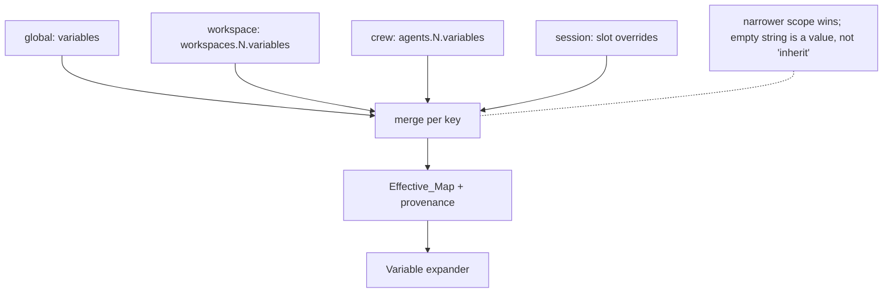
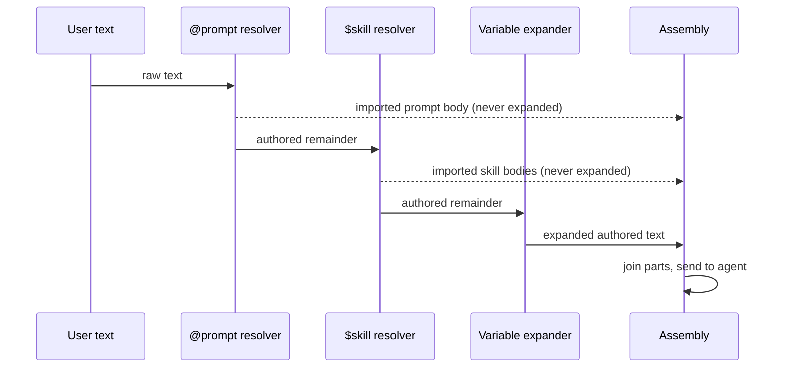

# Design Document

> Code citations name a file and a symbol, never a line number: the anchors in this spec drifted twice during implementation (once across 315 commits of `main`, once across 45), and a number that is wrong reads as authoritative.

## Overview

Crew Variables adds user-defined key/value pairs at four scopes that cascade — global, workspace, crew, session — and expands them as `{{name}}` in the text Kiro Crew sends to an agent. It introduces two new modules, one new file on disk (`variables.json`, holding every persisted pair), three in-memory config fields populated from that file, and a handful of expansion call sites. It introduces no new value in any child process environment and no expansion in any machine-readable surface.

Three properties do the work of keeping it safe, and every other decision follows from them:

1. **Expansion is confined to operator-authored text.** Four surfaces expand: the dashboard composer message, the agent system prompt, a cron `message`, and a monitor/auto-nudge instruction. A `SKILL.md` body, an `@prompt` file body, and a steering file do not — and neither does an inbound channel message, because that text is authored by a channel participant rather than by the operator (see "Surfaces that deliberately do not expand"). This is what makes "a value is as trusted as text the operator typed" a true statement rather than a hope, and it is why a skill installed from the public registry cannot read a variable.

   **"The composer surface" is not the same as "`_run_chat`", and conflating them was a real disclosure bug.** `_run_chat` is the dashboard turn engine, and roughly 22 call sites reach it — including `slack/handler.py`'s linked-thread route, which forwards a channel participant's raw message into it. A gate keyed only on `is_slash` and `_prompt_depth` (both satisfied by an ordinary inbound message) therefore expanded participant text, and the reply mirrored back to the thread the participant reads. Expansion is now **opt-in** via a keyword-only `operator_authored` flag that DEFAULTS TO FALSE, and exactly four call sites set it: the composer POST, regenerate, edit-resend, and rewind replay — each of which carries the operator's own composer text. Opt-in rather than opt-out so a call site added later fails safe and any new claim of operator authorship shows up in the diff. `test_variables_operator_authored.py` enumerates every caller and fails if an unlisted one opts in; it also asserts the composer DOES opt in, so the suite cannot pass on a build where nothing expands at all.

   Note this is a second, independent axis from the transport ratchet. Enumerating the five inbound transport modules could not have caught it, because the expansion was never in a transport module — it was in the engine those modules call.

   **What this does NOT give you is confidentiality, and the boundary is softer than the inbound refusal makes it look.** Refusing to expand inbound channel text stops a participant reading a value by *sending* `{{NAME}}`. It does not stop them reading it at all: the agent system prompt IS operator-authored, so it still expands on a channel turn, and anyone in `allowed_users` can ask the agent to repeat its own prompt. Treat the inbound refusal as removing one direct read path and as an integrity boundary (participant text cannot reach the expander), never as a guarantee that a channel participant cannot learn a value. This is acceptable only because a value is declared non-secret — v1 has no secret store, and the validator's 4096-char cap and no-`{{`-in-values rule are integrity rules, not protection. Anything that must not be read by an `allowed_users` member does not belong in a variable.
2. **`$skill` and `@prompt` resolution happens against pre-expansion text.** A value therefore cannot load a skill or inline a prompt file, structurally, without sanitizing values.
3. **Expansion is single-pass.** A substituted value is never rescanned, so there are no cycles and no escalation through nested tokens.

The codebase already states principle 1 in prose. The `$skill` gate at `dashboard/chat_runner.py` reads:

```python
        # Operates ONLY on the user's typed message, never on @prompt-substituted
        # content: `prompt_expanded` is True when an @prompt body replaced `message`
        # above (at the same _prompt_depth=0), so we skip $skill here to prevent a
        # prompt author's embedded $tokens from silently loading extra skills into
        # the context (expand-what-the-user-typed, principle of least surprise).
```

This design extends "expand what the user typed" from `$skill` to `{{var}}`.

## Architecture

### New module: `src/kiro_crew/variables.py`

Everything lexical and validating lives in one leaf module importing nothing from `kiro_crew` beyond `typing`. That constraint is not stylistic — `cron.py` duplicates the `$skill` regex verbatim with the comment *"duplicated here to avoid a cron<->skills import cycle"*, and a variables module that must be importable from `config/loader.py`, `context.py`, `dashboard/chat_runner.py`, `cron.py` and the autonudge handler would hit the same wall if it reached back into any of them.

```python
RESERVED_TOKENS: frozenset[str]     # MAX_SUBAGENTS, VERBOSITY_BLOCK, WIDGET_BLOCK,
                                    # STOP_FILE, ALIAS, bot_name
NAME_RE: re.Pattern                 # ^[A-Za-z][A-Za-z0-9_]*$
TOKEN_RE: re.Pattern                # \{\{\s*([A-Za-z][A-Za-z0-9_]*)\s*\}\}
MAX_VALUE_LEN: int = 4096

def validate_pair(key: str, value: object) -> tuple[str, str] | tuple[None, str]:
    """Return (key, coerced_value) or (None, rejection_reason)."""

def expand(text: str, values: Mapping[str, str]) -> tuple[str, frozenset[str]]:
    """Single-pass substitution. Returns (result, unresolved_names).

    Unknown names are left byte-identical. An empty mapping returns the input
    object unchanged without scanning it.
    """
```

`expand` uses one `TOKEN_RE.sub` with a replacement **callable**, so a value containing `{{other}}`, `\1` or `\g<0>` is inserted literally — `re.sub` with a function never re-interprets the replacement. That single choice satisfies the single-pass and no-recursion requirements at once.

### New module: `src/kiro_crew/config/variables_store.py`

Every persisted pair lives in `variables.json` beside `config.json`. One flat document, three scope containers, one writer:

```jsonc
{
  "global":     { "orgName": "Acme", "baseUrl": "https://api.dev.internal" },
  "workspaces": { "ops":     { "queue": "oncall" } },
  "crews":      { "oncall":  { "baseUrl": "https://api.example.com" } }
}
```

Session scope is deliberately absent from the file: it is per-turn state and is never persisted.

The store's path is derived from `config_path()` rather than hardcoded, so a relocated or test-redirected config root carries the store with it. The module is a leaf and imports `loader` lazily, because `loader` imports it.

**Why this is not in `config.json`, which is the load-bearing decision here.** `KiroCrewConfig.save()` serializes the MERGED config and replaces the whole file, and `to_dict()` builds an explicit key dict, so the config file is a lossy whole-document rewrite of exactly the keys the dataclasses model. For a map whose only legitimate writer is a dedicated endpoint, that produced a trilemma in which every available behaviour for the `variables` slot during an unrelated `save()` is wrong in a different way:

- **serialize the merged value** — overwrites a base value the `config.local.json` overlay shadowed. Because the overlay wins at load, `merged[key] == overlay[key]` for every overlay-defined leaf, so the shadowed base value is not in the merged view at all and the overwrite is unrecoverable;
- **preserve it while holding the config lock** — `save()` is a sync method reached from 13 async call sites, so a contended POSIX flock stalls the event loop;
- **preserve it with an unlocked read** — the read-then-write window silently drops a variables write that already returned 200 to its caller.

Moving the data out deletes the trilemma instead of choosing a position in it. `to_dict()` emits no `variables` at any scope (a small `_no_vars` filter drops the field from each nested `asdict`), so `save()` has nothing to preserve, no lock to interact with, and no window. The same move removes three further mechanisms that existed only because the map sat inside a two-layer document with a whole-file writer: the overlay-subtraction exemption in `_subtract_overlay`, the overlay-owned-key refusal on the endpoint, and the deleted-workspace resurrection guard. None of them are live, and none need replacing.

**The costs, stated rather than buried.** Variables are no longer part of `config.json`, so a backup, snapshot or sync that covers that one file does not cover them — only one that covers the data directory does. A hand-edit goes to `variables.json`, which is a second file for a user to learn. There is no migration path, and none is owed: no released version stored variables anywhere, so nothing existing is stranded; a `variables` key hand-added to `config.json` is simply not read.

**Read is tolerant, write is strict, and the asymmetry is deliberate.** `read_store()` never raises: a missing file, unparseable JSON, an OS error, or a top-level non-object all resolve to an empty document and therefore to no variables, with a warning naming the file, because a broken store must not take the gateway down over an optional feature. The write path refuses instead. `patch_store` runs through `update_config_locked(..., stamp_meta=False, on_corrupt="fail")` — inheriting that helper's advisory lock, atomic replace, mode preservation and symlink handling — so a corrupt store fails the write rather than being reset to `{}`, which would delete every pair at every scope to service one patch. `stamp_meta=False` keeps config's bookkeeping keys out of a document whose shape is exactly the three containers. After a successful write the file mode is tightened to 0600; a filesystem that refuses the `chmod` logs at DEBUG and does not fail the write, since the mode is defence in depth and the values are declared non-secret.

**Malformed-container refusal survived the move, and belongs to the data.** A container that is ABSENT is created — that is the legitimate first write. A container that is PRESENT but holds a non-mapping raises `MalformedStore` carrying the dotted path (`global`, `workspaces`, `workspaces.<name>`, …), because replacing it would discard whatever the operator hand-wrote and there is no second copy. "Do not replace a value whose shape you cannot interpret" is a property of the data, not of the file it lives in, so it moved into the store rather than being deleted with the mechanisms above.

### In-memory config fields

The three `variables` fields stay on the dataclasses in `config/loader.py` — `KiroCrewConfig`, `WorkspaceConfig`, `KiroCrewAgentConfig`, each with `_meta` metadata — because the whole cascade reads them at runtime. They are simply not part of `config.json`'s on-disk shape. `_apply_variables_store(cfg)` fills them after load (and after any migration write-back), keyed by workspace and crew name, which is only known once those entries have been built and migrated.

A store entry naming a workspace or crew the config does not define is **skipped, not created**. That entry is stale data — the name was deleted after the variable was set — and materializing it on the read path would resurrect a deleted scope, which is the class of bug the endpoint refuses on the write path. Because the entry is inert rather than dangerous, no separate resurrection guard is needed: `_migrate_workspaces` reads only `dir`, and nothing in the config document can carry a variable in the first place.

### Resolution

```python
@dataclass
class VariableResolution:
    values: dict[str, str]                    # the Effective_Map
    winning_scope: dict[str, str]             # key -> global|workspace|crew|session
    shadowed: dict[str, list[str]]            # key -> scopes it overrode
    agent_name: str                           # the crew the layers came from
    workspace_name: str                       # the workspace the layers came from

def resolve_variables(
    config: KiroCrewConfig,
    agent_name: str | None = None,
    session_overrides: Mapping[str, str] | None = None,
) -> VariableResolution
```

The resolution reports which crew and workspace it actually took layers from, so a caller can show the resolution without repeating the selection rules. Rejected pairs are not carried on the result: validation happens where the pairs are read (`coerce_variables`) and on the write path, and both report by warning or by 400 rather than by a field a caller would have to remember to read.

Layers merge global → workspace → crew → session, each overriding per key. The workspace layer applied is the one the session actually resolved to, which `resolve_agent_bindings` (`loader.py`) already derives — including its existing warn-and-fall-back when a crew names a missing workspace, so the variable layer inherits that behavior rather than reimplementing it. A caller naming a crew that is not in `config.agents` gets the DEFAULT crew's layers, logged at WARNING rather than DEBUG: it is the right default and the wrong answer, and it is invisible in the reply. That miss already shipped once here, because the dashboard passes the resolved kiro-agent runtime name, which is never a key in `config.agents`.

The merge is keyed on **key presence, not truthiness**. `resolve_memory_store_config` (`loader.py`) skips an empty value because an unset field there means "inherit"; here an empty string is a legitimate value meaning "deliberately blank at this scope", so `if key in layer` is the test, not `if layer[key]`.



**Provenance is now cheap, because there is only one file.** Winning scope and shadowing fall out of the merge itself, so the resolver reports them on the same pass it resolves on, and no colder path is needed. The earlier design carried a `variable_sources()` helper that re-read the raw `config.json` and `config.local.json` dicts to attribute each pair to a file, because `KiroCrewConfig.load()` deep-merges the overlay before dataclass parsing and that attribution is destroyed by the merge. With the pairs in a single-layer store there is no second file to attribute to: the supplying SCOPE is the whole of a pair's provenance. What remains for the CLI, `GET /api/variables` and `doctor` is the scope information the merge already produced.

### Session layer

The session layer exists because a pure cascade otherwise has no answer to "flip this one value mid-conversation": the only lever would be switching crew, and switching crew resets the session (`dashboard/chat_handlers.py`). It is modeled on the per-session model override — a slot field plus `PUT /api/chat/slots/{slot}/variables`, transient, never written to config, cleared when the session ends. It is deliberately the last thing built (see the task plan) so it can be dropped without touching any other layer.

### Expansion call sites

There is no single funnel. `ContextBuilder.build_message` (`context.py`) takes one `text: str` parameter and is the funnel for the *context prelude* across all ten of its callers, but the dashboard's user message is finalized separately — `chat_runner` mutates `message` through the `@prompt` and `$skill` stages and only later combines it at `chat_runner.py`. So expansion is applied per boundary, with a source guard against a missed one.

| Surface | Where | Note |
|---|---|---|
| Agent system prompt | `context.py`, after both prompt branches converge | Must sit after `_load_agent_prompt` so a custom agent's own prompt content is covered too. `_resolve_prompt_templates` has ONE call site shared by all three prompt branches, so it is NOT bypassed for custom agents -- the convergence point is required for the prompt BODY, not for the token pass |
| Dashboard chat message | `chat_runner.py`, between resolution and assembly | The one refactor in this design |
| ~~Inbound channel message~~ | **NOT expanded — withdrawn.** No expander on any inbound dispatch: `messaging/dispatch.py`, `slack/handler.py`, `slack/transport_dispatch.py`, `discord/transport_dispatch.py`, `telegram/transport_dispatch.py` (the `messaging` layer covers Webex, WeCom, Weixin and Teams) | This text is Participant_Text, not operator configuration; expanding it disclosed operator config to anyone in `allowed_users`. Held by the ratchet `test_variables_channels.py::TestNoInboundTransportExpands`, which fails if any of those five regains an expander. These paths still pass an explicit crew, because the agent system prompt — which IS operator-authored — still expands on a channel turn |
| Cron `message` | `cron.py`, at dispatch | Editing a variable changes the next run; the stored job is untouched. Expansion runs on `message` BEFORE `last_result` is prepended: that block is a previous run's MODEL OUTPUT, so scanning it would expand tokens the model wrote |
| Monitor loop instruction | `dashboard/handlers/autonudge.py`, before the `{{STOP_FILE}}` replace | Reserved token resolves last |

### The one refactor: caller-controlled assembly in `chat_runner`

Both text-importing helpers currently resolve *and* concatenate, returning a single string: `_expand_prompt_mention` (`chat_runner.py`) returns `(expanded_message, status)` with the prompt body prepended, and `_expand_dollar_skills` (`chat_runner.py`) returns `(expanded_message, count)` having appended one `[Skill: name]` block per resolved skill.

Because both fold Imported_Text into the same string as Authored_Text, expanding that string would expand skill and prompt bodies. Each is split into a parts-returning form and the caller assembles:

```python
authored, prompt_blocks, _status = _resolve_prompt_mention(message, state, slot)
if "$" in authored and not is_slash and not prompt_expanded and _prompt_depth < 1:
    authored, skill_blocks, _n = _resolve_dollar_skills(authored, state, slot, session_key)

authored, unresolved = variables.expand(authored, resolution.values)   # Authored_Text only

message = "\n\n".join([*prompt_blocks, authored, *skill_blocks])
```

This ordering is what makes the refusal and no-escalation requirements structural: the `$skill` and `@prompt` resolvers see pre-expansion text, so no value can load either; and the blocks they return never pass through `expand`.



### Surfaces that deliberately do not expand

`mcpServers` `command`/`args`/`env`, agent spec JSON, and app manifests are untouched. `env` is opaque string→string passthrough today, validated only for shape at `dashboard/handlers/mcp_custom.py` and copied verbatim into a 0600 sidecar at `mcp_gateway/rewriter.py`; `${env:VAR}` reaches a child as a literal. Leaving that alone is a decision: with secrets out of scope, expanding into `env` would add a credential-shaped path with none of the protections a credential needs. Agent spec JSON is excluded on the authority of the `_placeholder_values` docstring (`apps/bridges.py`), which requires that its values never come from a writable location — and `variables.json` is exactly such a location, written by a dashboard endpoint.

Steering files are excluded for the same reason as skills: `_load_steering_resources` (`context.py`) globs `file://` resources including project-scoped paths, so a cloned repository's steering file is no more trusted than a registry skill.

**Inbound channel messages are excluded, and this one is a reversal.** An earlier draft of this design expanded them on every transport (Requirement 4.4, now withdrawn). A variable's value is operator configuration; an inbound message is authored by a channel participant, and `allowed_users` admits several people. Expanding inbound text therefore turned "send the bot `{{NAME}}` and read the reply" into a read primitive over operator config — a disclosure that does not depend on the values being secrets, because the operator never opted into publishing them. Widening the boundary from Slack to Discord and Telegram widened the disclosure rather than completing the feature. Restoring expansion needs a trustworthy operator-vs-participant identity at the dispatch boundary, which the transport layer does not carry; that is a security design decision, not plumbing. The refusal is held by a ratchet enumerating the inbound transport modules (`test_variables_channels.py::TestNoInboundTransportExpands`) rather than by convention.

## Data model summary

| Stored at | Type | Default | Scope |
|---|---|---|---|
| `variables.json` → `global` | `dict[str, str]` | `{}` | global |
| `variables.json` → `workspaces.<n>` | `dict[str, str]` | `{}` | that workspace |
| `variables.json` → `crews.<n>` | `dict[str, str]` | `{}` | that crew |
| (slot field, never persisted) | `dict[str, str]` | `{}` | one session |

Each of the first three is mirrored at runtime onto the matching dataclass field (`KiroCrewConfig.variables`, `WorkspaceConfig.variables`, `KiroCrewAgentConfig.variables`) by `_apply_variables_store`, and none of them is emitted by `to_dict()`.

Validation, applied identically at every scope from one code path: name matches `^[A-Za-z][A-Za-z0-9_]*$`, name is not a Reserved_Token, value coerces to `str` from `str|bool|int|float`, length ≤ 4096, no ASCII control characters except tab, and no `{{` (which is what makes expansion idempotent across boundaries, not merely single-pass per call). On the read path a rejected pair is dropped with a warning naming key, scope and reason and the rest of the scope survives; on a `PUT` the same rule refuses the request instead.

## Interfaces

### CLI

```
kirocrew vars list [--workspace NAME] [--agent NAME]   # effective map + winning scope
kirocrew vars show KEY                                  # value at every scope, winner marked
kirocrew vars set KEY VALUE [--workspace NAME | --agent NAME]
kirocrew vars unset KEY [--workspace NAME | --agent NAME]
```

Scope defaults to global when no selector is given. Modeled on the `workspace` verb group (`cli.py`, handler `cli_commands.py`). There is no `--local` flag and no `use` verb: the store has a single layer, so there is no machine-local destination to route a write to, and a cascade has no active-set concept to switch.

### HTTP

- `GET /api/variables` → the pairs the STORE holds per scope, the Effective_Map for the active context, and per-key winning scope and shadowed scopes. The per-scope maps come from the store rather than from the resolved cascade — reporting resolved values as editable is what let an earlier panel offer to edit a pair it did not own. The workspace and crew maps are keyed off the CONFIG's names, so a stale store entry for a deleted workspace is not advertised as editable, and the endpoint agrees with what the loader resolves.
- `PUT /api/variables` → a PER-KEY patch at one scope: `{"scope": ..., "workspace": ..., "set": {...}, "delete": [...]}`. Writable scopes are `global` and `workspace`; crew pairs are stored and resolved but not yet editable here (the crew form is a later task).
- `PUT /api/chat/slots/{slot}/variables` → session layer (last task; droppable).

**The patch is per-key rather than per-scope, and that is the fix for a data-loss finding that recurred in three review rounds.** The replace form required the client to echo back a map it had read, so two clients replacing the same scope clobbered each other's unrelated edits and a value the client could not see was dropped. Naming only the keys to change removes the class: a key nobody named is never read, never rewritten, and cannot be lost. Deletion is therefore an explicit verb rather than absence from a map, which also keeps the empty string unambiguous — it is a legal value that still overrides a broader scope, so it cannot share an encoding with "unset".

Validation refuses rather than drops. The loader deliberately drops a bad pair with a warning so one hand-edited mistake cannot cost the rest of a scope or fail a load; a dashboard write is interactive, and silently discarding a pair the user just typed would look like a save that worked. Every refusal is a 400 carrying a machine-readable `code`, and every one is recorded through the SEL audit helper so a refusal is never invisible in the audit trail:

| `code` | Condition |
|---|---|
| `variables_invalid_json` / `variables_invalid_body` | Unparseable body, or a body that is not an object |
| `variables_invalid_scope` | A scope outside the writable set |
| `variables_invalid_values` | Neither `set` nor `delete` present, or either of the wrong type |
| `variables_invalid_pair` | A name or value the shared grammar rejects, on either `set` or `delete`; names the key |
| `variables_conflicting_change` | The same key both set and deleted in one request |
| `variables_unknown_workspace` | A workspace the config does not define — refused for the caller's sake, since such an entry would be inert |
| `variables_malformed_container` | A store container that is present but not an object; names the path to repair |
| `config_corrupt` (500) | The store cannot be parsed; the write fails rather than resetting it |

The write is dispatched through `run_config_write`, which holds the loop-side asyncio lock and, inside the worker thread, the store's own advisory flock via `update_config_locked`. The blocking wait therefore never happens on the event loop — the defect that made the in-config version of this write untenable.

### UI

Settings gains an **Environment Variables** panel — `website/src/pages/SettingsPage.tsx` holds the registry as a function returning `{ key, label: i18nT(...), icon, group, description }` entries plus a render switch, so this is one import, one entry, one switch line, and one new `website/src/pages/settings/VariablesPanel.tsx`. It goes in `GROUP_PREFERENCES` beside Skills: both are stores of user-authored content, unlike the `GROUP_SYSTEM` cluster. The panel leads with **Global Environment Variables** and also lists per-workspace pairs, so a workspace layer is editable without visiting another page.

The crew form on the Agents page gains the crew's own pairs beside the existing workspace, memory-store and model fields — `website/src/pages/KiroCrewAgentsPage.tsx` already renders those three as `Field` + `SimpleSelect`, so the shape is established.

Each row shows its winning scope and whether it shadows a broader one. The composer flags an unknown `{{name}}` before submission, reusing `website/src/components/composerTokens.ts`.

## Key decisions

**A cascade, not switchable named sets.** Postman needs named environments because a collection is not a context; Kiro Crew has real scope objects, so values hang on them and no second selector is introduced. The cost is that there is no one-click dev→prod flip: you change context by switching crew (which resets the session) or by editing a value. The session layer is the mitigation. If a named set is wanted later it is additive — a crew's layer is already a bag, so a set name is an indirection added at the leaf without changing any other scope.

**Variables live on the workspace as values, not as a switcher.** Hosting *values* per workspace is fine and is what the cascade needs; hosting the *selector* there would not work, since `WorkspacePicker.tsx` is create-only, `api.chatSlotWorkspace` is referenced only by tests, and `KiroCrewCfgTab.tsx` renders workspaces read-only. The workspace layer reaches a session through the crew's existing binding.

**"Environment Variables" in the UI, `variables` in the store and on the dataclasses.** The user-facing term is the one users know. The stored and in-memory names avoid `env` because it already denotes the process environment, `mcpServers.env`, and `~/.kiro/crew/.env` here.

**An unknown token stays literal.** Silently substituting empty turns `curl {{baseUrl}}/health` into `curl /health`, which an agent may act on. A literal `{{baseUrl}}` is visibly wrong.

**Single-pass, with no value sanitizing.** Values are inserted verbatim. Safe only because `$skill`/`@prompt` resolution runs first and expansion never touches Imported_Text. Had either been relaxed, values would need escaping, and escaping a URL or a jq filter correctly is a worse problem than reordering a pipeline.

**Original text is stored unexpanded.** Session history keeps what the user typed, so a session read back later shows `{{baseUrl}}`, not a stale value.

**A dedicated `variables.json`, not a key in `config.json`.** The full reasoning is in "New module: `config/variables_store.py`" above; the short form is that `save()` is a whole-document replace built from an explicit key list, and every behaviour it could have for a variables slot loses data, stalls the loop, or drops a write that already returned 200. Rejected alternatives, each rejected on its own grounds rather than on preference: serializing the merged value (silently overwrites a shadowed base value, unrecoverably), preserving it under the config lock (blocks the event loop from a sync method reached from 13 async call sites), and preserving it with an unlocked read (loses a concurrent variables write). A separate file removes the choice rather than re-making it.

**No machine-local overlay, and that is a real subtraction.** `config.local.json` is deep-merged over `config.json`, so an in-config map got a shared-vs-machine-local split for free — and that overlay was half of what made the map unsafe to save, because the overlay wins at load and a shadowed base value is therefore absent from the merged view. The store has one layer, so variables lose that split: a value that must differ per machine has to differ by crew or workspace, or be hand-edited into that machine's store. Two mechanisms that existed only to manage the overlay are gone with it — the `_subtract_overlay` exemption and the overlay-owned-key refusal (`variables_overlay_owned`), which named the class of key the endpoint could read but not write. Cron and monitor paths resolve exactly the Effective_Map a dashboard session for that crew would, with no shared-vs-local divergence left to document.

**Variables are not covered by a `config.json` backup.** Anything that snapshots or syncs that single file no longer captures variables; only something covering the data directory does. This is the price of the paragraph above, and it belongs in the user documentation rather than only here.

## Error handling

| Condition | Behavior |
|---|---|
| Invalid name, reserved name, bad type, oversize, control char (read path) | Pair dropped, WARNING naming key + scope + reason, rest of scope retained, load succeeds |
| The same, on a `PUT` | Refused with 400 and a `code`, naming the offending key; nothing is written |
| Store absent | Resolves no variables; created by its first write |
| Store unreadable, unparseable, or not a JSON object (read path) | Resolves no variables, WARNING naming the file and how to repair it; the gateway still boots |
| Store unparseable (write path) | 500 `config_corrupt`; the document is NOT reset, so one patch cannot delete every pair at every scope |
| Store container present but not an object (write path) | 400 `variables_malformed_container` naming the dotted path; the hand-written value is left exactly as it is |
| Store entry for a workspace or crew the config does not define | Skipped at load (inert, never materializes the name); refused with 400 `variables_unknown_workspace` on write, so a caller is not told a save took effect when it cannot |
| Crew names a missing workspace | Fallback workspace's layer applied, matching `resolve_agent_bindings`' existing warning |
| Crew name absent from `config.agents` | Default crew's layers applied, at WARNING — the right default and the wrong answer, and otherwise invisible |
| Every layer empty | Empty Effective_Map; `expand` returns the input object unscanned |
| Unknown `{{name}}` in Authored_Text | Left literal; returned in `unresolved`; surfaced once per message in the dashboard |
| Malformed token (`{{ }}`, `{{1abc}}`, `{{a-b}}`) | Left literal; not reported as unresolved |
| `{{name}}` in Imported_Text | Left literal; not logged at INFO or above |
| `variables` key hand-added to `config.json` | Not read; it is not the Global_Layer, and there is no migration from it |

No condition aborts a turn or fails a config load.

## Testing strategy

**Unit — `variables.py`.** Token grammar including the malformed cases; `expand` returning the identical object for an empty mapping; single-pass proof (a value containing `{{other}}` where `other` is also defined stays literal); values containing `\1` and `\g<0>` inserted verbatim; one test per `validate_pair` rejection reason; `RESERVED_TOKENS` asserted to cover every `{{...}}` literal found by scanning `context.py`, `dashboard/handlers/autonudge.py` and `slack_manifest.py`, so a future built-in token cannot be added without updating the list.

**Unit — the store.** A round trip through `patch_store` / `read_store`; a first write creating an absent container; a per-key patch leaving every unnamed key untouched; `delete` removing a key and leaving the rest; a present-but-non-mapping container raising `MalformedStore` with the right path and changing nothing on disk; an unparseable store failing the write rather than resetting it; an unreadable or non-object store resolving to no variables without raising; the file mode after a write, and a write still succeeding when `chmod` is refused. Derive every path from `tmp_path`.

**Unit — resolution.** Each layer alone; each adjacent pair overriding; a four-layer stack where every layer defines the same key; an empty string at a narrow scope beating a non-empty broad one; missing-workspace fallback with the warning asserted; an unknown crew name falling back to the default crew with the warning asserted; a store entry for a workspace the config does not define being skipped rather than materialized. Assert `to_dict()` emits no `variables` at any scope and that a whole-config `save()` leaves `variables.json` byte-identical — that assertion is the one that would catch a regression back into the trilemma.

**Security — the three that matter.** A value is absent from the assembled prompt when the only reference is inside a `SKILL.md` body. A value of `$<a real installed skill>` does not load that skill. A value of `@<a real prompt file>` does not inline it. Each asserts on the assembled text, not an internal flag.

**Source guard.** A test enumerating the expansion boundaries that fails when a new `build_message` caller appears without one — the countable-guard pattern the repo already uses for armed-resource release paths, chosen because the failure mode here is a silently missed surface rather than a wrong value. For the inbound transports the guard runs the OTHER way: a ratchet asserting no transport dispatch ever *gains* an expander, since there the silent failure is a regained surface, not a missed one. A newly added transport dispatch belongs in that ratchet, not in the boundary list.

**Frontend.** Panel render, add/edit/delete at each scope, scope/shadow indicators, validation error surfacing, unknown-token composer hint, crew-form pairs, a11y. Run the full `npx vitest run --no-coverage` from `website/`, since colocated specs assert exact label text.

**Gates, at CI parity.** `isort --check-only src/kiro_crew test`, `flake8 src/kiro_crew test`, `mypy src/kiro_crew/`, `npx tsc -b` from `website/`, then after `git fetch origin`: `I18N_BASE_REF=origin/main npm run i18n:check`, the render gate with the same base ref, and `HARNESS_BASE_REF=origin/main python3 scripts/check_harness_parity.py`. Every new behavior revert-verified.

## Out of scope

**Secrets — decided, not deferred.** There is no secret, secure, masked or encrypted variable type, and the UI and docs say so plainly. The reason is measured rather than cautious: `_AGENT_DENIED_ENV_KEYS` (`sandbox.py`) is a closed set of 13 literals and `_SENSITIVE_ENV_PREFIXES` is 5 literal prefixes, so nothing today scrubs a user-named key from an agent subprocess. Postman's model shows the shape of a real fix — secret-capability there is a store with an encryption key plus an enforced `vault:` namespace that may not be added to an ordinary variable scope, and script access is a per-consumer opt-in that errors when disabled. A later phase can add that as its own store under its own reference namespace; nothing in this design needs to change to accommodate it, which is precisely why no half-measure belongs here.

**Agent-set variables.** Postman's `pm.environment.set()` has no analogue. Moving the pairs out of `config.json` removes the governance-surface argument that used to carry this — `_clamp_security_bounds` and the policy pins guard the config document, not the store — but it does not make agent writes safe: a value an agent sets is pasted verbatim into operator-authored text on the next turn, so an agent that can write one can influence the next system prompt it is given. Granting that is a separate security conversation, and the endpoint stays the only writer until it happens.

**`${env:VAR}` in `mcpServers`.** Useful and much smaller, but independent of this feature and safe to ship separately.
